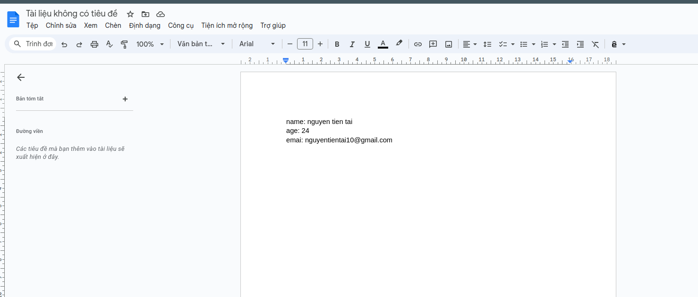
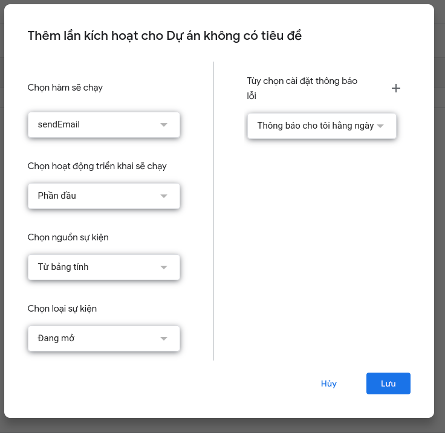

# Create api google docs

## 1. Create docs and write docs into google 



## 2. Choose > Extensions > Apps Scripts 

## 3. Copy code Js convert

```
    function doGet() {
        var doc = DocumentApp.getActiveDocument();
        var body = doc.getBody();
        var data = {};
        var elements = body.getNumChildren();
        for (var i = 0; i < elements; i++) {
            var child = body.getChild(i).copy();
            var text = child.getText().trim();
            var elementType = child.getType();
            if (elementType == DocumentApp.ElementType.PARAGRAPH) {
            var firstColonIndex = text.indexOf(':');
            if (firstColonIndex !== -1) {
                var key = text.slice(0, firstColonIndex).trim();
                var value = text.slice(firstColonIndex + 1).trim();
                data[key] = value;
            }
            }
        }
  var jsonString = JSON.stringify(data);
  return ContentService.createTextOutput(jsonString).setMimeType(ContentService.MimeType.JSON);
}
```

## 4. Deployment > Option new Deployment > Deployment


## 5. Send email with docs excel 

```
    function sendEmail(e) {
    const name = e.values[1];
    const reward = e.values[2];
    const phone = e.values[3];
    const recipientEmail = "a@gmail.com, b@gmail.com"; 
    const subject = `${name} Just register advise now`;
    const message = "<p><b>Name:</b> " + name + "</p><p><b>Reward:</b> " + reward + "</p><p><b>Phone:</b> " + phone + "</p>";
    MailApp.sendEmail({
        to: recipientEmail,
        subject: subject,
        htmlBody: message
    });
}

```

## 6. Trigger > add Trigger > 



