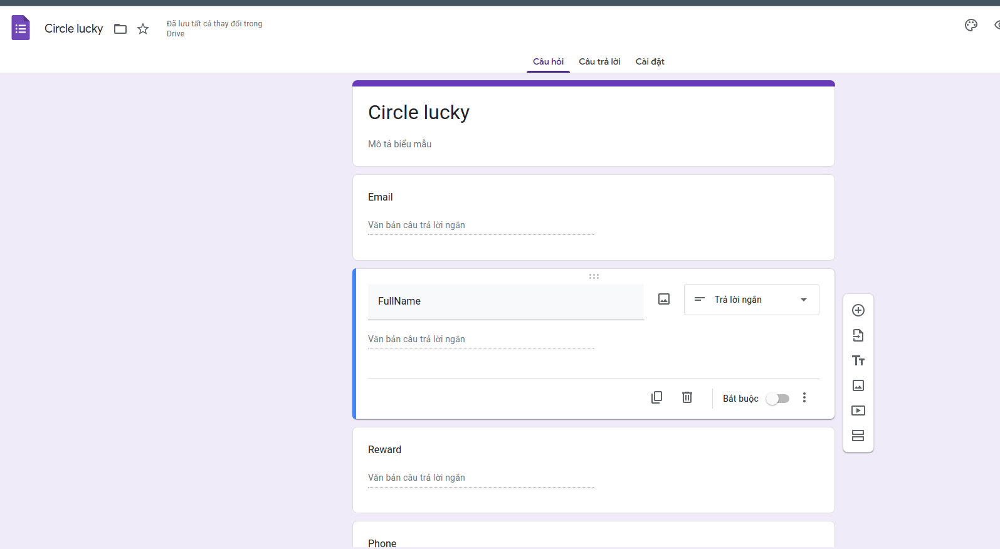
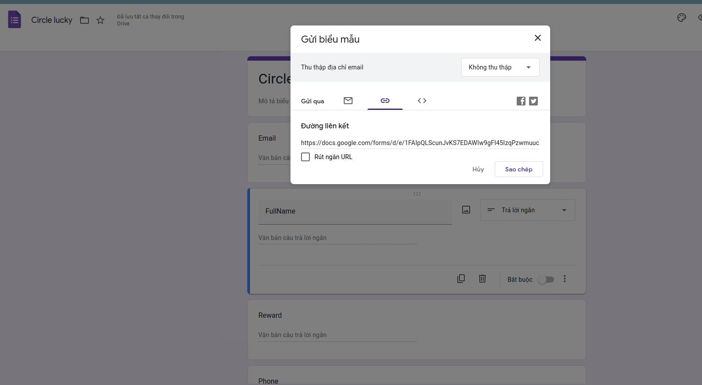

# Create api google docs

## 1. Create form and created we need

## 2. Choose as image

# 3. CTRL + SHIFT + N > Paste link just copy 

# 4. Enter form and click enter it will to Ok > Copy link example: https://docs.google.com/forms/d/e/${token}/formResponse

# 5. we copy link enter form and paste on text get entries or  F12 html copy entries